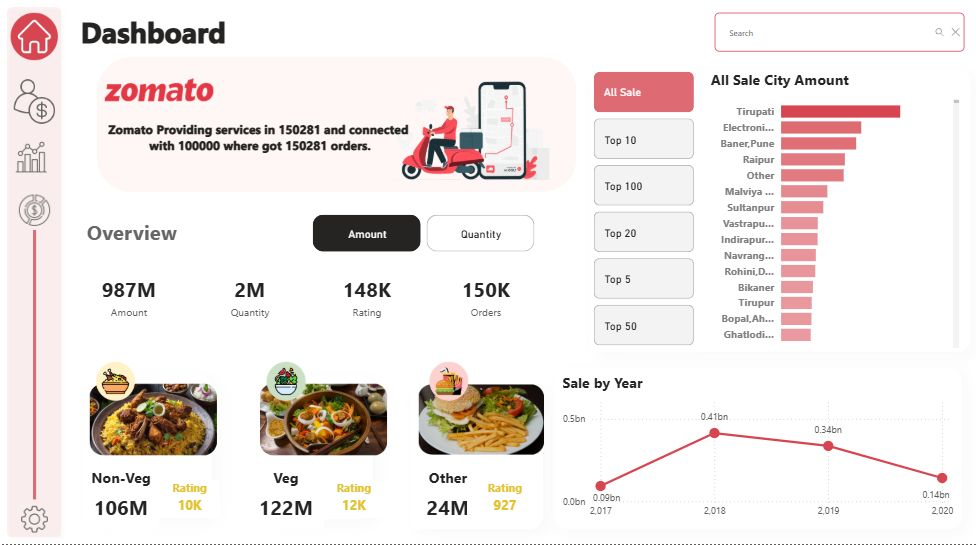
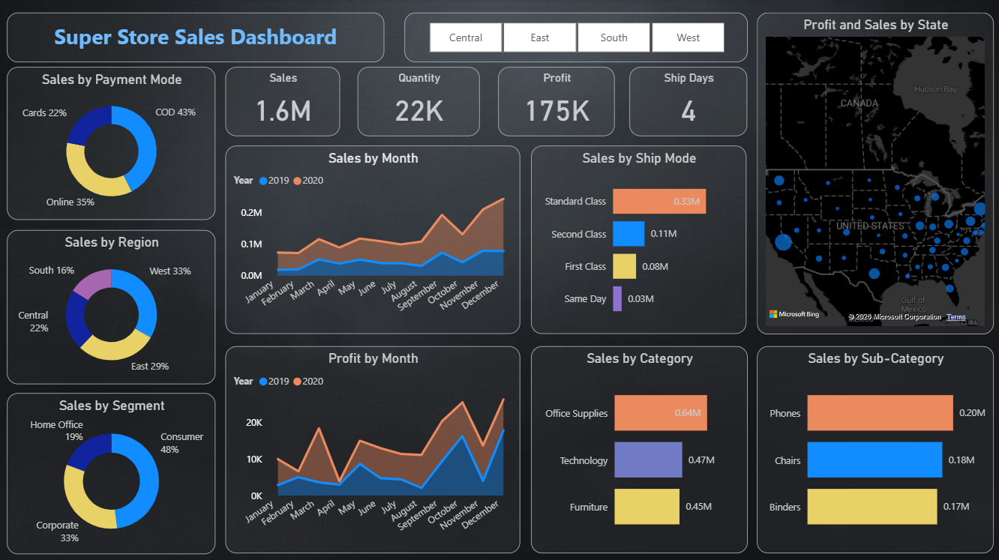
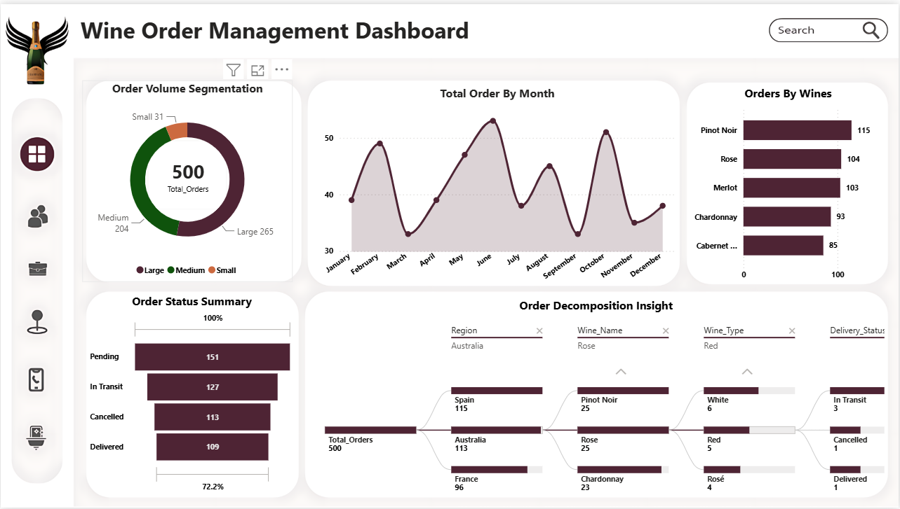
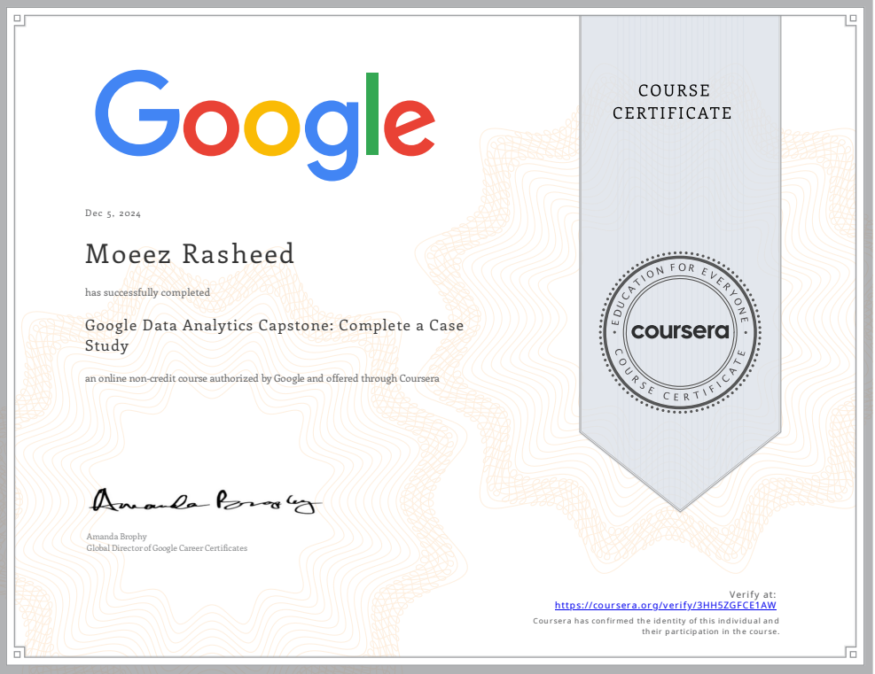
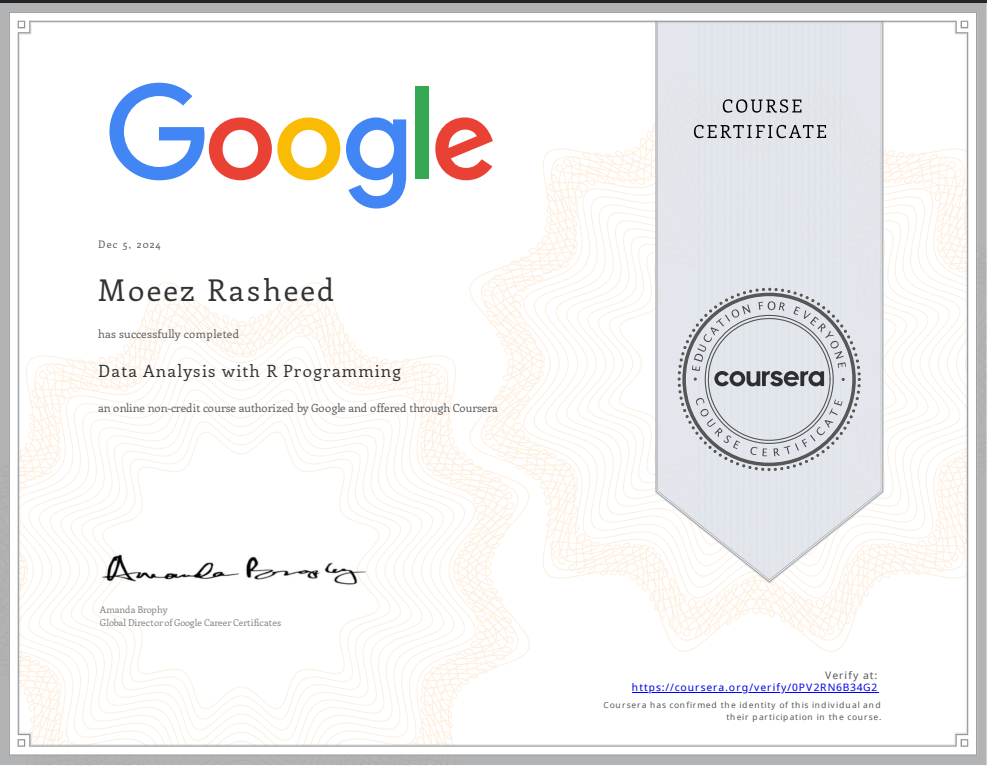
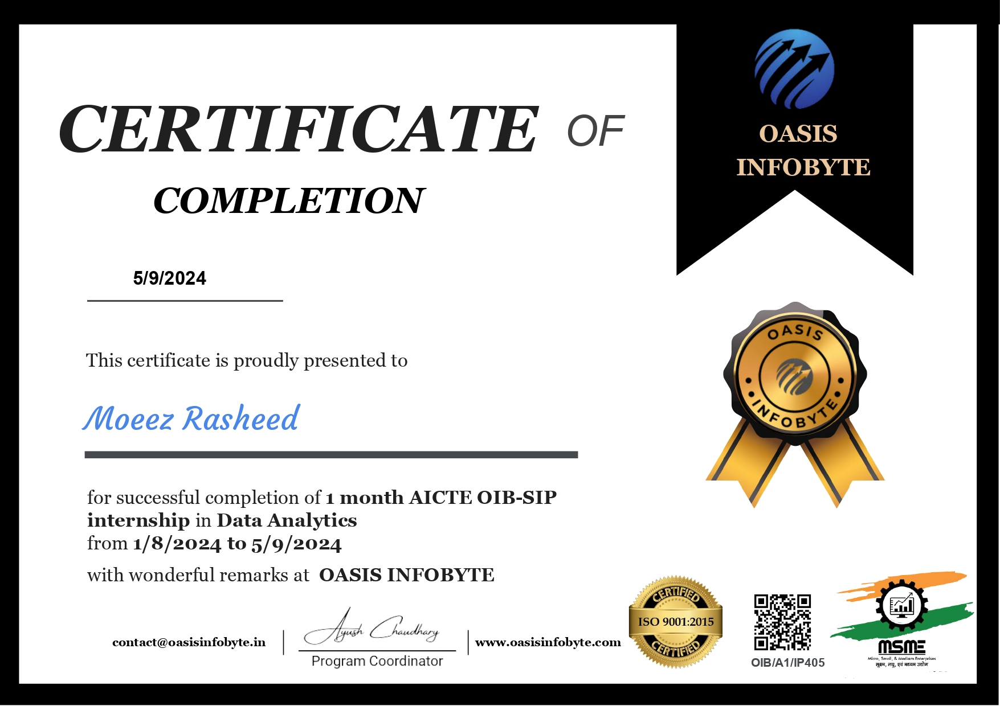
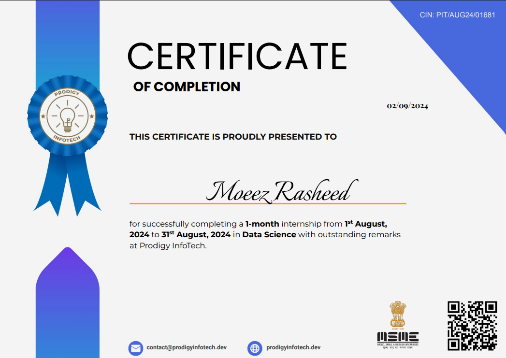

<div align="center">


<p align="center">
  
  
</p>

<p align="center">
  <a href="https://moeez276.github.io"></a>
  <a href="https://www.linkedin.com/in/moeezrasheed/"></a>
  <a href="https://mail.google.com/mail/?view=cm&fs=1&to=moeezrasheed153@gmail.com"></a>
  <a href="https://github.com/moeez276"></a>
</p>


</div>

---

### 🧠 About Me

I'm a Data Analytics student at Government College University Faisalabad (2023–2027), based in Faisalabad, Pakistan. I specialize in turning raw, messy datasets into interactive Power BI dashboards that drive real business decisions — covering everything from data cleaning and exploratory analysis to visual storytelling with filters, maps, and decomposition trees. My toolkit spans Power BI, Excel, Python, and SQL, and I've applied it across retail, food delivery, and e-commerce datasets through internships and independent projects.

**Open To:** Internships · Freelance BI Projects · Collaborations

---

### 🛠️ Tech Stack

**Languages & Querying**

<p align="left">
  
</p>

**BI & Data Visualization**

<p align="left">
  
  
  
</p>

**Data Processing**

<p align="left">
  
  
</p>

**Core Skills**

<p align="left">
  
  
  
  
</p>

---

### 🚀 Featured Projects

<details open>
<summary><strong>📊 Zomato India Food App Dashboard</strong></summary>
<br>

Power BI dashboard analyzing delivery shop data for insights on ratings, cuisines, locations, and order trends.



| Layer | Details |
|---|---|
| Stack | Power BI, Power Query |
| Focus | Analytics |
| Key Views | Ratings, Cuisines, Locations, Order Trends |
| Repository | [Zomato-Dashboard](https://github.com/moeez276/Zomato-Dashboard) |

</details>

<details open>
<summary><strong>🏬 Super Store Sales Dashboard</strong></summary>
<br>

Superstore sales dashboard using Power BI, incorporating maps, filters, and slicers for dynamic data exploration.



| Layer | Details |
|---|---|
| Stack | Power BI |
| Focus | Data Visualization |
| Key Features | Maps, Filters, Slicers |
| Repository | [Super-Store-Annual-Report](https://github.com/moeez276/Super-Store-Annual-Report) |

</details>

<details open>
<summary><strong>🍷 Wine Order Management Dashboard</strong></summary>
<br>

Power BI dashboard tracking wine order volume, monthly trends, and status across regions and wine types, with an interactive decomposition tree.



| Layer | Details |
|---|---|
| Stack | Power BI |
| Focus | Business Analysis |
| Key Features | Decomposition Tree |
| Repository | [Wine-Order-Management-PowerBi-Dashboard](https://github.com/moeez276/Wine-Order-Management-PowerBi-Dashboard) |

</details>

---

### 💼 Experience

**Data Science Intern — Prodigy InfoTech**
*Aug 2024 – Aug 2024*
Completed a 1-month internship in Data Science, working on applied data analysis tasks.

**Data Analytics Intern — Oasis Infobyte**
*Aug 2024 – Sep 2024*
Completed a 1-month AICTE OIB-SIP internship in Data Analytics.

**Software Intern (Exploratory Data Analysis) — CodexCue Software Solutions**
*Jul 2024 – Aug 2024*
Completed an internship focused on Exploratory Data Analysis, contributing to ongoing projects and initiatives.

---

### 🏆 Achievements

<div align="center">

| Recognition | Details |
|---|---|
| 🎓 Google Data Analytics Capstone | Completed full case-study capstone project |
| 📜 6 Professional Certifications | Google/Coursera, CodexCue, Oasis Infobyte, Prodigy InfoTech |
| 💼 3 Completed Internships | Data Science & Data Analytics domains |
| 📊 6 Power BI Dashboards | Retail, food delivery, and e-commerce datasets |

</div>

---

### 📜 Certifications

**Google / Coursera**

<p align="center">
  
  
  
</p>

**Internship**

<p align="center">
  
  
  
</p>

---

### 📈 GitHub Analytics

<p align="center">
  
  
</p>

<p align="center">
  
</p>

<p align="center">
  
</p>

---

### 🎯 Current Focus

```yaml
learning:
  - Advanced DAX & Power BI Service
  - SQL for deeper querying
building:
  - New Power BI dashboards across retail & e-commerce datasets
exploring:
  - Python for automated reporting
open_to:
  - Internships
  - Freelance BI projects
  - Collaborations
```

---

### 📫 Connect With Me

<p align="center">
  <a href="https://www.linkedin.com/in/moeezrasheed/"></a>
  <a href="https://www.facebook.com/mian.moeez.rasheed"></a>
  <a href="https://www.instagram.com/moeez__rasheed"></a>
  <a href="https://mail.google.com/mail/?view=cm&fs=1&to=moeezrasheed153@gmail.com"></a>
  <a href="https://wa.me/923068342275"></a>
  <a href="https://moeez276.github.io"></a>
</p>

<div align="center">

*"Data is only powerful when it's understood — I build dashboards that make it understood."*

</div>


